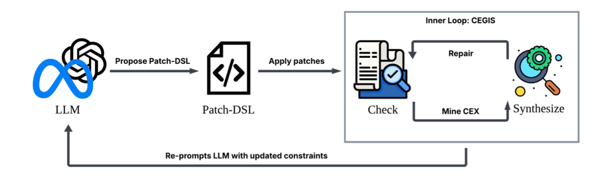

CeLoR Documentation
===================

**CeLoR** (CEGIS-in-the-Loop Reasoning) is an inference-time verification and repair system for LLM-generated Kubernetes manifests. The system uses LLM calls to generate parametric repair templates with holes, then executes a local CEGIS (Counterexample-Guided Inductive Synthesis) loop with a custom synthesizer to fill those holes. The custom synthesizer enumerates candidates and learns constraints from oracle failures to efficiently find valid repairs.

Key Features
------------

* **Minimal Token Usage**: LLM generates repair templates with holes (typically 1 call)
* **Custom Synthesizer**: Lexicographic candidate enumeration with constraint pruning
* **Privacy-Preserving**: All synthesis happens locally on your machine
* **Deterministic**: Identical inputs produce identical patches
* **Multi-Oracle**: Supports K8s schema, policy, security, and resource oracles
* **Fix Bank**: Cross-run learning and team knowledge sharing
* **Domain-Agnostic Core**: Extensible architecture for K8s, Python, JSON, and more

Quick Links
-----------

* :doc:`getting_started` - Get started with CeLoR
* :doc:`core_concepts/architecture` - **Two-phase architecture overview**
* :doc:`core_concepts/overview` - Understand the motivation and goals
* :doc:`core_concepts/key_concepts` - Key terms and concepts explained
* :doc:`reference/api_reference/core` - API reference documentation

.. toctree::
   :maxdepth: 2
   :caption: Getting Started

   getting_started

.. toctree::
   :maxdepth: 2
   :caption: Core Concepts

   core_concepts/overview
   core_concepts/architecture
   core_concepts/key_concepts
   core_concepts/oracles
   core_concepts/fix_bank

.. toctree::
   :maxdepth: 2
   :caption: Patch Generation Layer

   patch_generation_layer/index
   patch_generation_layer/patch_dsl
   patch_generation_layer/template_generation

.. toctree::
   :maxdepth: 2
   :caption: CEGIS Layer

   cegis_layer/index
   cegis_layer/holes_and_templates
   cegis_layer/cegis_loop
   cegis_layer/constraints

.. toctree::
   :maxdepth: 2
   :caption: Example: K8S Manifest Repair

   example/problem_statement
   example/repair_workflow
   example/k8s_oracles
   example/k8s_patch_dsl

.. toctree::
   :maxdepth: 2
   :caption: Reference

   reference/usage_guide
   reference/oracle_system
   reference/limitations
   reference/glossary
   reference/api_reference/core
   reference/api_reference/adapters
   reference/api_reference/llm